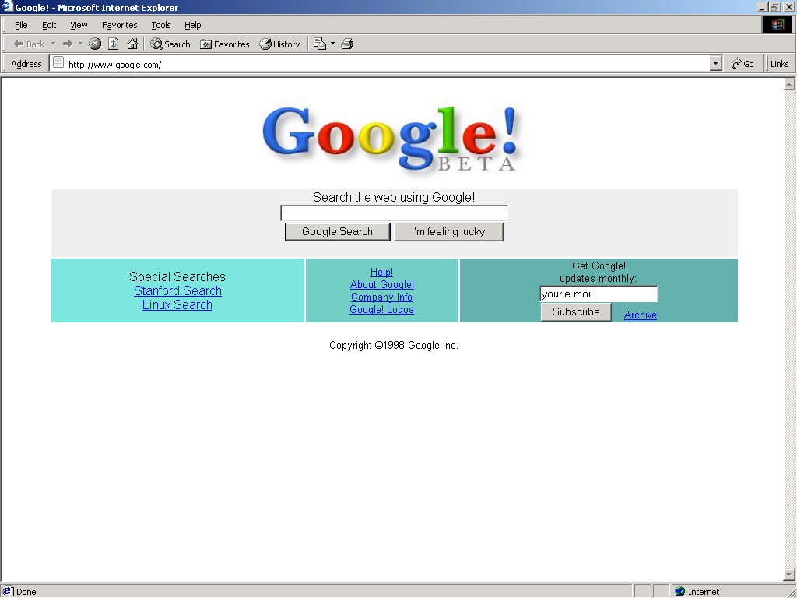
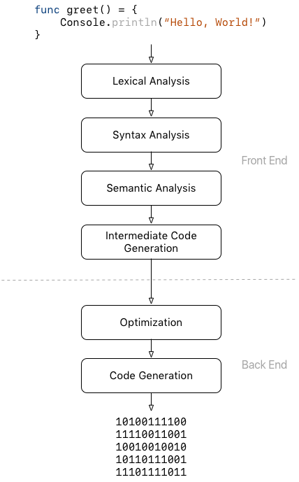
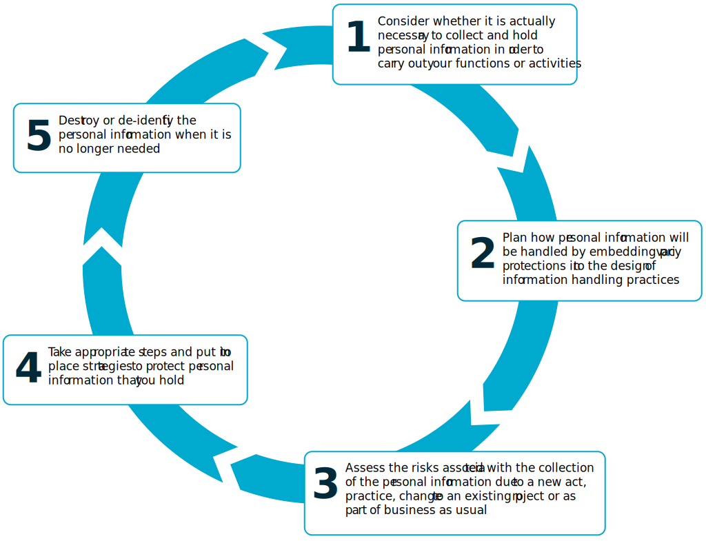
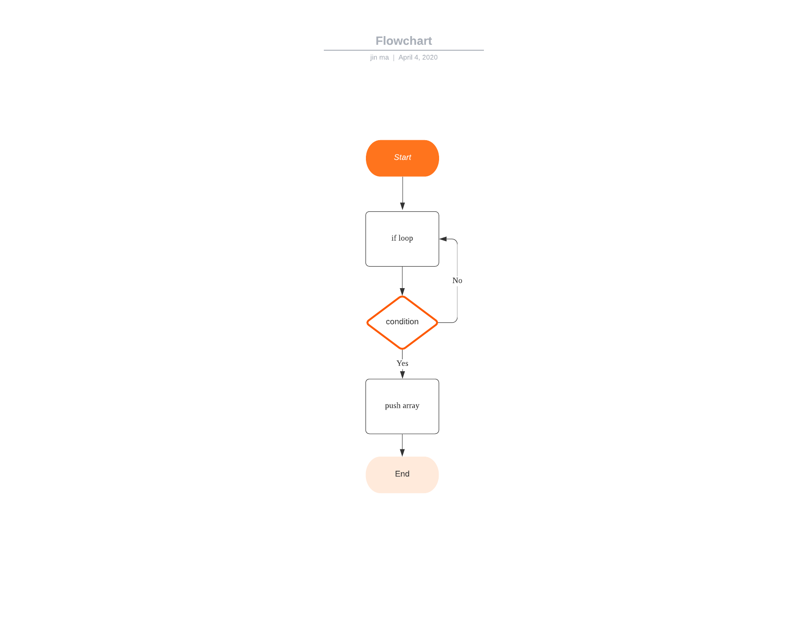

Q1-Research the development of the internet from 1980 to today. You must describe at least FIVE key events in the development of the internet. You can refer to events, people of significance, or technologies and how they have changed over time.(300-500)

Q1A

1982: Transmission Control Protocol (TCP) and Internet Protocol (IP), as the protocol suite, commonly known as TCP/IP, emerge as the protocol for ARPANET. This results in the fledgling definition of the Internet as connected TCP/IP internets. TCP/IP remains the standard protocol for the Internet. And the next year, The Domain Name System (DNS) establishes the familiar .edu, .gov, .com, .mil, .org, .net, and .int system for naming websites. This is easier to remember than the previous designation for websites, such as 123.456.789.10.

1990: Tim Berners-Lee, a CERN scientist, the European Organization for Nuclear Research, develops HyperText Markup Language (HTML). This technology have a huge impact on how we navigate and view the Internet today. And the next year CERN introduces the World Wide Web to the public.


1994: Netscape Communications is born. Microsoft creates a Web browser for Windows 95. Yahoo! is created by Jerry Yang and David Filo, two electrical engineering graduate students at Stanford University. The site was originally called "Jerry and David's Guide to the World Wide Web."


1996: Almost 77% online users send or receive email once every few weeks. Nokia releases the Nokia 9000 Communicator, the first cellphone with internet capabilities. HotMaiL launches as one of the world’s first Web-mail services, its name a reference to the HTML internet language used to build webpages.


1998: The Google search engine is born, changing the way users engage with the Internet. The Internet Protocol version 6 introduced, to allow for future growth of Internet Addresses. The current most widely used protocol is version 4. 


2007: Apple company launched iphone, which was almost renewed interest in mobile web applications and design, and now almost all web browsers support mobile web,like :Chrome, Edge, Firefox, Safari...


2016: Google Assistant, a voice-activated personal assistant program, many Internet companies jump into the "smart" computerized assistant marketplace. Google joins Amazon's Alexa, Siri from Apple, and Cortana from Microsoft.

---

Q2-Define the features of the following technologies that are essential in terms of the development of the internet:
 - packets
 - IP addresses (IPv4 and IPv6)
 - routers and routing
 - domains and DNS

Explain how each technology has contributed to the development of the internet.(50-100 each)

Q2A
- packets: Packet is a term first coined by Donald Davies in 1965. It is used to describe a segment of data sent from one computer or device to another over a network. A packet is used because it divides data into easy manage parts, keep the network resources not stop by a single big file.

- IP addresses (IPv4 and IPv6): Each computer on a network has a unique identifier. Computers use the unique identifier to send data to specific computers on a network. The unique identifier for a computer is called its IP address. IPv4(uses 32 binary bits) and 6(uses 128 binary bits) are two standards of IP address.

- routers and routing: Routing is the process of delivering information to its intended destination. A router is a device that actually delivers information to its intended destination, using one of several different routing protocols.

- domains and DNS: The Domain Name System (DNS) is the yellow page of the Internet. We search information online through domain names, like google.com or facebook.com. Browsers interact through Internet Protocol (IP) addresses. DNS translates domain names to IP addresses so browsers can load Internet resources.

---

Q3-Define the features of the following technologies that are essential in terms of the development of the internet:
 - TCP
 - HTTP and HTTPS
 - web browsers (requests, rendering and developer tools)

Explain how each technology has contributed to the development of client and server communication over the internet (50 - 150 words for each technology)

Q3A

- TCP: TCP (Transmission Control Protocol) is a standard that defines how to establish and maintain a network conversation through which application programs can exchange data. TCP works with the Internet Protocol (IP), which defines how computers send packets of data to each other. Together, TCP and IP are the basic rules defining the Internet.   
https://en.wikipedia.org/wiki/Transmission_Control_Protocol

- HTTP and HTTPS: HTTP(Hyper Text Transfer Protocol). Communication between client computers and web servers is done by sending HTTP Requests and receiving HTTP Responses. HTTPS(Hypertext Transfer Protocol Secure). It is used for secure communication over a computer network. 
Different: https://www.globalsign.com/en/blog/the-difference-between-http-and-https

- web browsers: a application for you to accessing information for WWW. When you requests a website, the browser will get the information from server and display in your device. 
https://www.mozilla.org/en-US/firefox/browsers/what-is-a-browser/

---

Q4-Identify THREE data structures used in the Ruby programming language and explain the reasons for using each.

Q4A

- Array: Arrays are ordered, integer-indexed collections of any object. Start at 0. A new array can be created by using the literal constructor []. Arrays can contain different types of objects, like: string, float, integer...

For example:

```ruby
colors = [ 'Blue', 'Gree', 'Yellow' ]  #String
num = [1, 2, 3]  #Integer
```
And there are many method to use: https://ruby-doc.org/core-2.7.0/Array.html

- Hash: A Hash is a dictionary-like collection of unique keys and their values. It's similar to arrays in that they are indexed collection of object references. However, while you index arrays with integers, you can index a hash with objects of any types: strings, regular expressions, and so on. The style for hash is a list of key => value pairs between braces.

For example:

```ruby
h = {'dog' => 'canine', 'cat' => 'feline', 'donkey' => 'asinine', 12 => 'dodecine'}
```
More method to share: https://ruby-doc.org/core-2.7.0/Hash.html

- Iteration: Iterators return all the elements of a collection, one after the other. The each iterator returns all the elements of an array or a hash. There are many loop method for iteration: map, each... https://www.geeksforgeeks.org/ruby-types-of-iterators/

For example:

```ruby
ary = [1,2,3,4,5]
ary.each do |i|
   puts i
end
```
The result is:

```ruby
1
2
3
4
5
```
---

Q5-Describe the features of interpreters and compilers and how they are different.(100-200)

Q5A

Compiler is a program can translates code written in a high-level programming language (like JavaScript or Java) into low-level code (like Assembly) directly executable by the computer or another program like a virtual machine.

A compiler usually have two parts: 
- Front end: Generally include lexical analysis, syntax analysis, semantic analysis and intermediate code generation.
- Back end: Includes optimization and code generation.

Both the front end and the back end perform their operations in a sequence of phases. Each phase generates a particular data structure from another data structure emitted by the phase before it.



Interpreter is another way to get code to run on your processor, which is not the same as a compiler. An interpreter translates code like a compiler but reads the code and immediately executes on that code, and therefore is faster than a compiler. Thus, interpreters are often used in software development tools as debugging tools, as they can execute a single in of code at a time. Compilers translate code all at once and the processor then executes upon the machine language that the compiler produced. If changes are made to the code after compilation, the changed code will need to be compiled and added to the compiled code (or perhaps the entire program will need to be re-compiled.) But an interpreter, although skipping the step of compilation of the entire program to start, is much slower to execute than the same program that’s been completely compiled. 
However, interpreter has usefulness in areas where speed doesn’t matter. which makes it more portable than a compiler when working between hardware architectures. Examples of programming languages that use interpreters are Python, Ruby, Perl, and PHP.

[More information](https://www.microcontrollertips.com/compilers-translators-interpreters-assemblers-faq/)


---

Q6 	Identify TWO commonly used programming languages and explain the benefits and drawbacks of each(200-400)

Q6A

## JavaScript
### Summary 

JavaScript(JS) is a lightweight, interpreted, object-oriented language with first-class functions, and is famous as the scripting language for Web pages, but it's used in many non-browser environments as well. It is a prototype-based, multi-paradigm scripting language that is dynamic, and supports object-oriented, imperative, and functional programming styles.

JavaScript runs on the client side of the web, which can be used to design / program how the web pages behave when it happen of an event. JavaScript is a easy to read and powerful scripting language, widely used for controlling web page behavior.

JavaScript's dynamic capabilities include runtime object construction, variable parameter lists, function variables, dynamic script creation (via eval), object introspection (via for ... in), and source code recovery (JavaScript programs can decompile function bodies back into their source text).

You can put it in <'head'> and <'body'>, anywhere you want.

Head
```js
<script>
function myFunction()
{
    document.getElementById("demo").innerHTML="My first JavaScript function";
}
</script>
```
Body
```js
<body>
<h1>website</h1>
<p id="demo">content</p>
<button type="button" onclick="myFunction()">try it</button>
<script>
function myFunction()
{
    document.getElementById("demo").innerHTML="My first JavaScript function";
}
</script>
</body>
```
### Publish packages: NPM
[More information](https://www.npmjs.com/)

### Benefits
- Speed. Client-side JavaScript is very fast because it can be run immediately within the client-side browser. Unless outside resources are required, JavaScript is unhindered by network calls to a backend server.

- Simplicity. JavaScript is relatively simple to learn and implement.

- Popularity. JavaScript is used everywhere on the web.

- Interoperability. JavaScript plays nicely with other languages and can be used in a huge variety of applications.

- Server Load. Being client-side reduces the demand on the website server.

- Gives the ability to create rich interfaces.

### Drawbacks
- Client-Side Security. Because the code executes on the users’ computer, in some cases it can be exploited for malicious purposes. This is one reason some people choose to disable Javascript.

- Browser Support. JavaScript is sometimes interpreted differently by different browsers. This makes it somewhat difficult to write cross-browser code.

[More information](https://en.wikipedia.org/wiki/JavaScript)

## Ruby

Ruby is an interpreted, high-level, programming language. It was designed and developed in the mid of 1990s by Yukihiro / まつもとゆきひろ-"Matz" Matsumoto in Japan.

It supports multiple programming paradigms, including procedural, object-oriented, and functional programming. 

The recent version is 2.7.X

Ruby is object-oriented: every value is an object.  Variables always hold references to objects. Every function is a method and methods are always called on an object.

The syntax of Ruby: Class and method definitions are signaled by keywords, whereas code blocks can be both defined by keywords or braces.

The Ruby official distribution also includes irb, an interactive command-line interpreter that can be used to test code quickly. The following code fragment represents a sample session using irb: 
```ruby
$ irb
irb(main):001:0> puts 'Hello, World'
Hello, World
 => nil
irb(main):002:0> 1+2
 => 3
 ```
 ### Public packages: Rubygems

RubyGems.org is the Ruby community’s gem hosting service. Instantly publish your gems and then install them. Use the API to find out more about available gems. Become a contributor and improve the site yourself.


### Benefits
- Multi-paradigm: you can do Object-Oriented, Functional, Imperative programming. Mix and match, thats suits your objective
- A joy to code in
- Multi-platform: Linux, Windows, Mac, iOS, Android, etc
- Mature, well-maintained, battle-tested by largest websites in the world
- Treasure trove of gems / libraries / plugins
- Awesome testing infrastructure

### Drawbacks
- Slower than some other languages
- Not Flexible

---

Q7-Identify TWO ethical issues from the areas below and discuss the extent to which an IT professional is ethically responsible in terms of the issue.

List of topics containing ethical issues:
 - access to a user’s personal information (medical, family, financial, personal attributes such as sexuality, religion, or beliefs)
 - intellectual property, copyright, and acknowledgement.
 - criminal acts such as theft, fraud, trafficking and distribution of prohibited substances, terrorism
 - GPS tracking data and other types of metadata, MAC addresses, hardware fingerprints
 - freedom of thought, conscience, speech and the media
 - aggressive sales and marketing practices designed to mislead and deceive consumers
 - trading of shares on the stock exchange OR crypto-currencies

For each ethical issue identify a source of legal information relating to the ethical issue and discuss whether the law is helpful in assisting a developer to act in an ethical way. (Word count guide: 200 words max)

Conduct research into a case study of ONE of the ethical issues you have chosen discuss how an ethical IT professional should respond to the case study and how they might mitigate or prevent ethical breaches. (Word count guide: 400 - 600 words)

Q7A

#### For each ethical issue identify a source of legal information relating to the ethical issue and discuss whether the law is helpful in assisting a developer to act in an ethical way. (Word count guide: 200 words max)

 - access to a user’s personal information (medical, family, financial, personal attributes such as sexuality, religion, or beliefs)

OAIC have an [Australian Privacy Principles guidelines](https://www.oaic.gov.au/privacy/australian-privacy-principles-guidelines/), This ‘Guide to Securing Personal Information’ provides guidance on the reasonable steps entities are required to take under the Privacy Act 1988 (Cth) (Privacy Act) to protect the personal information they hold from misuse, interference, loss, and from unauthorised access, modification or disclosure. It also includes guidance on the reasonable steps entities are required to take to destroy or de-identify personal information that they hold once it is no longer needed (unless an exception applies). It's quiet important for us nowadays . Every IT practitioner should do the right thing, when you face this issus. A good example is when you register a website, it will popup a window that show the rights they will get from you, and you see the legal and choose agree or not. I think when i handle personal information , i should consider these steps to protect it.


- intellectual property, copyright, and acknowledgement.

The government of Australia have improve relevant laws and regulations to protect investing. [Australian IP(Intellectual property) law](http://www.copyright.org.au/acc_prod/ACC/Find_an_Answer/ACC/Public_Content/Find_an_Answer.aspx?hkey=b0de2cd4-daa3-47da-95a5-1e7ecdc8dddc) is designed to encourage innovation and protect businesses that develop original IP in order to have a competitive advantage. And we can find the Copyright protection is a part of the laws. It's designed to encourage and protect those businesses which invest their time and talent in the creation of new material. Australia is also a signatory to a number of international conventions that deal with copyright. For us personal, something may helpful : 1. terms of use and disclaimers; 2.register your Copyright; 3.use the digital millennium Copyright act.

#### Conduct research into a case study of ONE of the ethical issues you have chosen discuss how an ethical IT professional should respond to the case study and how they might mitigate or prevent ethical breaches.

One of the last news about personal information leak is Facebook sued.

Facebook has been dragged to federal court by an Australian privacy watchdog, allegedly for sharing personal data of over 0.3 million of its users. The data breach reportedly happened after the data of users was extracted by a personality quiz app called "This is your Digital Life" after which this data was leaked to Cambridge Analytica.

According to OAIC, Facebook was not at all transparent with its privacy settings. This made it difficult for the affected users to fathom about the data being shared with the app. The site’s design at the time, too, left them unable to exercise consent or control about how their personal information was disclosed.

The training of IT professionals and students usually focuses on technical knowledge and skills, we learn how to perform tasks, but with little consideration of how those abilities can be misused. In fact, many IT professionals approach their work like a hacker : whatever i can do, i'm entitled to do. In fact, many IT professionals don't even realize that their jobs involve ethical issues. but we make decisions on a daily basis that raise ethical questions. We even not think about some questions like : Can i read the private e-mail of my network users? Is it OK to monitor the Web sites visited by my network users? If i do read users' e-mail, should i disclose that policy to them? Before or after the fact?

For individual, I think in addition to self-restraint, legal means are also required. As internet develop, the laws will also complete someday, and a standard mandatory oversight body as well. In fact, more training from collage and educator are efficient. Conscious of ethical issues at the whole life cycle of your project like testing may save lots of money.

For a company, holds personal information must take reasonable steps to protect the information from misuse, interference and loss, as well as unauthorized access, modification or disclosure, and take reasonable steps to destroy the personal information they hold once it is no longer needed for any purpose for which it may be used or disclosed. Make sure to let user know that their information will be use when it will be. Sometimes a logbook will save your business. 

At the end , i want use the Spider-Man's classic dialogue "With great power comes great responsibility".

---

Q8-Explain control flow, using an example from the Ruby programming language(100)

Q8A

In Ruby, a good way to explain control flow is loop. You can find many logic realize by use loop. Control flow means  we are able to direct which lines of code needs to be executed and in which order. Loops allows us to repeat a process over and over again until a certain condition is met and the program determines it is ok to exit the loop. In other words, these statements are a piece of code that executes one after another until the condition is true and when the condition becomes false then code terminated. 

For example : break

In Ruby, Break statement is used to exit a loop when the condition is true. Break statement is basically used in while loop because in while loop the output is printed till the condition is true, when the condition is false the loop exited. The break statement is used inside the loop. The break statement are executed by break keyword. Break statement can also be used in for, while, and case control statements.

```ruby
i = 1
  
# using while loop 
while true   
  
    if i * 6 >= 30
          
        # using break statement 
        break  
          
    # ending of if statement     
    end   
      
    puts i * 6   
    i += 1
      
# ending of while loop 
end  
```
Output :
```ruby
6
12
18
24
```
Explanation: In above example, break statement is used to stop the execution of while loop when the condition if i * 6 >= 30 becomes true. Otherwise loop goes to infinite.

---

Q9-Explain type coercion

Q9A

Type coercion is the changing of an object’s type into another type, together with its value. For example, changing an Integer into a String with `#to_s` or a Float into an Integer with `#to_i`. 

There are 3 methods of type coercion :

***Explicit coercion***

Whenever `#to_s` is called on an object, it’ll always return a string. The most common coercion are : `#to_s` , `#to_i` , `#to_a` and `#to_h`

```ruby
10.0.to_i # => 10
"10".to_i # => 10
```

***Implicit coercion***

Only return a value when objects act like the type. This way we can be sure that the value acts like the type we want. 

These methods are : `#to_str`, `#to_int`, `#to_ary` and `#to_hash`.

The `#to_str` helper tries to convert to a string, but will raise a `NoMethodError` if the object doesn’t implement the method and can’t be implicitly coerced.

```ruby
10.to_int                           # => 10
10.0.to_int                         # => 10
require "implicit"
Implicit.new("10.0000123").to_int # => 10

# Unsuccessful coercions
"10".to_int             # => NoMethodError
"foo10".to_int          # => NoMethodError
[1, 2, 3].to_str        # => NoMethodError
{ :foo => :bar }.to_str # => NoMethodError
{ :foo => :bar }.to_ary # => NoMethodError
Object.to_str           # => NoMethodError
Object.new.to_str       # => NoMethodError
```

As you see , `#to_str` is only implemented on String in the [Ruby Standard Library](https://docs.ruby-lang.org/en/2.1.0/standard_library_rdoc.html).

Tips :  `+` is a implicit coercion. :scream:

***Enforcing Types***

Ruby also offers more resilient coercion methods when the type is of an unknown type and we want to make sure we get the correct type. They are : [`String(...)`](https://ruby-doc.org/core-2.5.1/Kernel.html#method-i-String)(click) , `Integer(...)`... 

```ruby
String(self)       # => "main"
String(self.class) # => "Object"
String(123456)     # => "123456"
String(nil)        # => ""

Integer(123.999)   # => 123
Integer("0x1b")    # => 27
Integer(Time.new)  # => 1204973019
Integer(nil)       # => TypeError: can't convert nil into Integer
```
---

Q10-Explain data types, using examples(100)

Q10A

- String : A string is a group of letters that represent a sentence or a word. Strings are defined by enclosing a text within single (') or double (") quote.
```ruby
puts "Hello " + "World"
===> Hello World
```
- Integer : Integer is held internally in binary form. Integer numbers are numbers without a fraction.
```ruby
puts 1
===> 1
```
- Booleans : Booleans are a special type of data used to represent one of two possible states, either true or false. 

```ruby
puts true
===> True
```
- Nil : Ruby has a special value that means the absence of value.

```ruby
name = "mary"
name = nil
puts name
===> nil
```
---

Q11-Here’s the problem: “There is a restaurant serving a variety of food. The customers want to be able to buy food of their choice. All the staff just quit, how can you build an app to replace them?”
 - Identify the classes you would use to solve the problem
 - Write a short explanation of why you would use the classes you have identified

 Q11A

 Classes need :

- FoodViews : The first page that show to customer, if they want 1. make a meal 2. review their meal and show the price 3. closed 

- FoodRepo : If choose 1, show the food menu then enter the number of foot to add to the meal database.

- FoodController : If choose 2, make sure there is a meal database, yes : show the meal list and price ; no : show dialog "You don't have a meal list, 1.back to menu 2.closed".

- FoodMenu : Initialize food name, price, id

---

Q12-Identify and explain the error in the code snippet below that is preventing correct execution of the program 

Q12A
```ruby
celsius = gets.to_i  #not a integer, change the object's type use to_i
fahrenheit = (celsius * 9 / 5) + 32
print "The result is: "
print fahrenheit
puts "."
```
```ruby
input 12
===> 53
```

---

Q13-The code snippet below looks for the first two elements that are out of order and swaps them; however, it is not producing the correct results. Rewrite the code so that it works correctly.

```ruby
arr = [5, 22, 29, 39, 19, 51, 78, 96, 84]
i = 0
while (i < arr.size - 1 and arr[i] < arr[i + 1])
	i = i + 1 end
puts i
    arr[i] = arr[i + 1]
    arr[i + 1] = arr[i]
```

Q13A

```ruby
arr = [5, 22, 29, 39, 19, 51, 78, 96, 84]
i = 0
while (i < arr.length-2 )
  if arr[i] > arr[i+1]
    arr[i] , arr[i + 1] = arr[i + 1] , arr[i]
  end
i += 1
end
puts arr
```
---

Q14-Demonstrate your algorithmic thinking through completing the following two tasks, in order:
 1. Create a flowchart to outline the steps for listing all prime numbers between 1 and 100 (inclusive). Your flowchart should make use of standard conventions for flowcharts to indicate processes, tasks, actions, or operations
 2. Write pseudocode for the process outlined in your flowchart

Q14A

1. flowchart as below : 


2. Pseudocode 

SET Arr_prime to empty

Create Arr 1 to 100

Arr each DO num

  IF num % num = 0 AND num % 1 = 0 THEN

  PUT num INTO Arr_prime

  END IF

END LOOP

---

Q15-Write pseudocode OR Ruby code for the following problem:
You have access to two variables: raining (boolean) and temperature (integer). If it’s raining and the temperature is less than 15 degrees, print to the screen “It’s wet and cold”, if it is less than 15 but not raining print “It’s not raining but cold”. If it’s greater than or equal to 15 but not raining print “It’s warm but not raining”, and otherwise tell them “It’s warm and raining”.

Q15A

```ruby
raining = true    #first variable
temperature = 16  #second variable
if true && temperature < 15
  puts "It's wet and cold"  
elsif false && temperature < 15
  puts "It's not raining but cold"
elsif false && temperature >= 15
  puts "It's warm but not raining"
else puts "It's warm and raining"
end

===> It's warm and raining
```

---

Q16-An allergy test produces a single numeric score which contains the information about all the allergies the person has (that they were tested for). The list of items (and their value) that were tested are:
 - eggs (1)
 - peanuts (2)
 - shellfish (4)
 - strawberries (8)
 - tomatoes (16)
 - chocolate (32)
 - pollen (64)
 - cats (128)

So if Tom is allergic to peanuts and chocolate, he gets a score of 34.

Write a program that, given a person’s score can tell them:
 a) whether or not they’re allergic to a given item
 b) the full list of allergies.

 Q16A

 ```ruby
 allergies = {
  cats:128,
  pollen:64,
  chocolate:32,
  tomatoes:16,
  strawberries:8,
  shellfish:4,
  peanuts:2,
  eggs:1
}

toms_score = 34
array_of_allergies = []

allergies.each do |key,value|
  if toms_score == 0
    break
  end
  if toms_score>= value
  toms_score = toms_score - value
  array_of_allergies<< key
  end
end
def allergic_to?(array_of_allergies, item)

  array_of_allergies.include?(item)
end

p allergic_to?(array_of_allergies,:tomatoes)
p array_of_allergies

===> false
===> chocolate, peanuts
```
